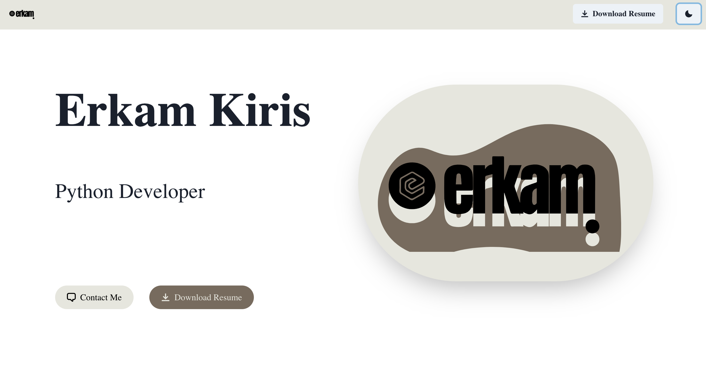

This project uses [`next/font`](https://nextjs.org/docs/basic-features/font-optimization) to automatically optimize and load Inter, a custom Google Font.

# Portfolio Webpage


## Description

Portfolio website which features some of my recent Github projects as well as my CV and skills.

This is a [Next.js](https://nextjs.org/) project bootstrapped with [`create-next-app`](https://github.com/vercel/next.js/tree/canary/packages/create-next-app).

## Getting Started

First, run the development server:

```bash
npm run dev
# or
yarn dev
# or
pnpm dev
# or
bun dev
```

Open [http://localhost:3000](http://localhost:3000) with your browser to see the result.

You can start editing the page by modifying `app/page.js`. The page auto-updates as you edit the file.


## Built With
This project was built using these technologies 
- Next JS
- Chakra UI
- Nodemailer
- GSAP

### Contact Me
In this section you can contact me through filling out the form, and can also download and preview my CV through the "Download CV" button.


## Help

Contact me through the form on the "Contact" page.

## Authors

* Erkam Kiris 
